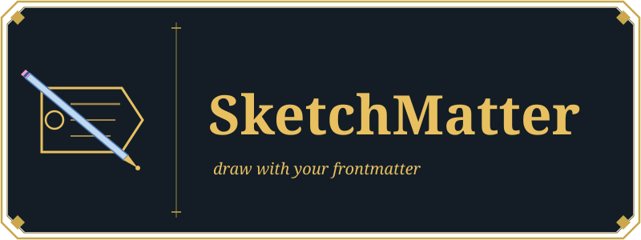
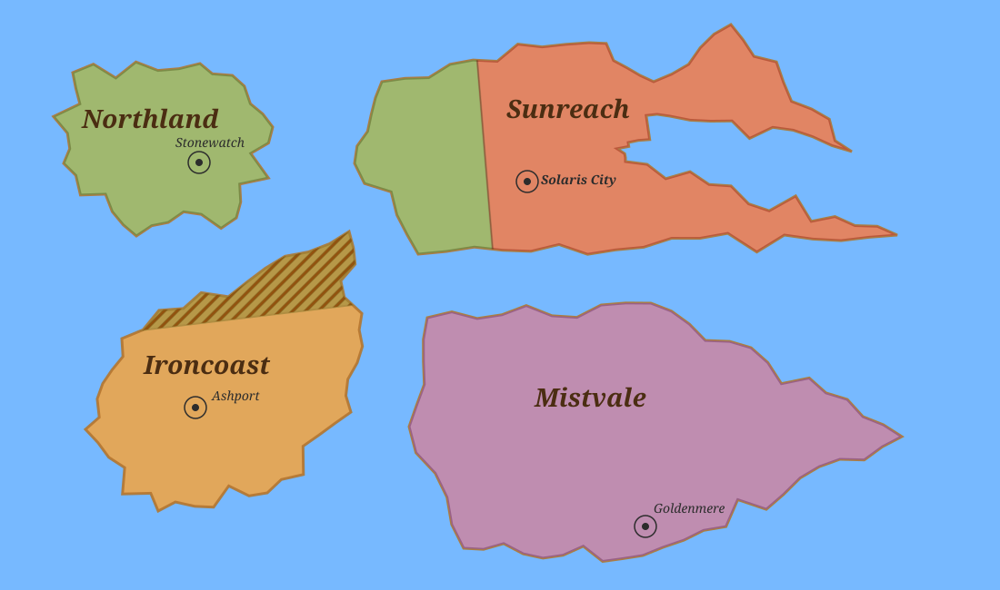
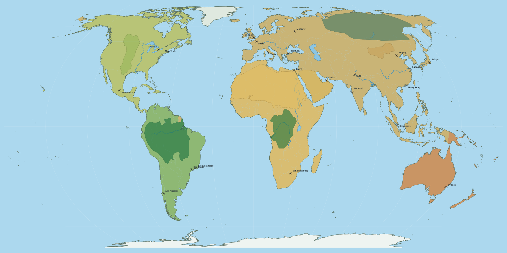
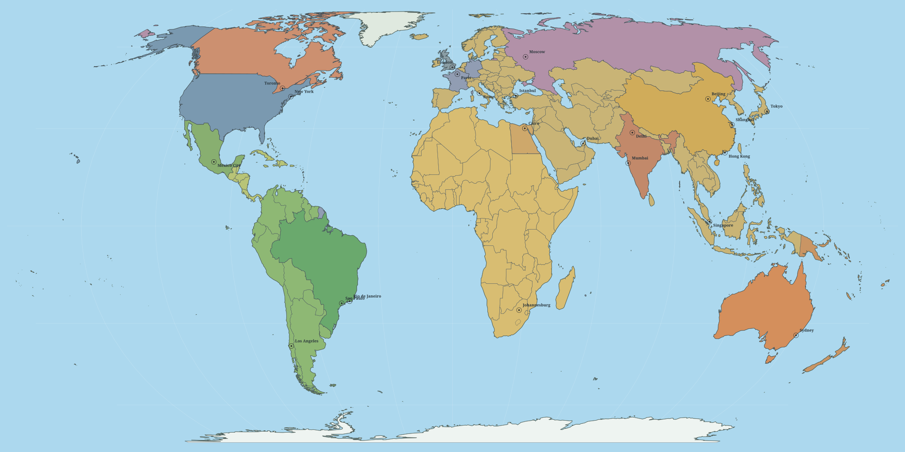

# SketchMatter Plugin for Obsidian

[](https://github.com/TylerCarrol/obsidian-sketch-matter/actions/workflows/lint.yml) [](https://github.com/TylerCarrol/obsidian-sketch-matter/actions/workflows/test.yml)


> This logo was created using this plugin and is available in the `/demo-vault`

**SketchMatter** renders SVG images from the frontmatter in Obsidian notes.

## Examples

> The following examples are available in the `/demo-vault`





## Features

### Preview Panel

- View image preview
- Edit by drag-and-drop
- Toggle a customizable grid
- Zoom and pan

### Export

- Export a render as **SVG**

### Inline Code Block

- Select an **image** and *optional* **view** to render directly in a note

### Details

- Draw [objects](#object-notes) from note frontmatter
	- Support built-in shapes: `polygon`, `polyline`, `line`, `circle`, `rect`, `ellipse`, `text`, and `composite`
	- Create [type definitions](#type-definitions) to extend base shapes, or *other* type definitions
- Order objects by **layer**
- Filter objects by **layer** using **views**
- **Blend** to soften edges
- **Mask** to keep items within certain bounds
- **Noise** to create jagged edges from a **seed**

## Object notes

An object note usually contains:

- a type tag such as `sketchmatter-type/continent`
- *optionally* additional type tags when the same note should render as **multiple** objects
- coordinates
- optional label coordinates for label rendering
- an optional layer override
- optional image IDs
- optional style overrides such as `fill`, `stroke`, `strokeWidth`, and `opacity`

Example:

```yaml
---
tags:
  - sketchmatter-type/continent
  - sketchmatter-type/label
sketchmatter-layer: 100
sketchmatter-coordinates:
  - "100, 100"
  - "300, 120"
  - "360, 240"
  - "220, 300"
sketchmatter-label-coordinates:
  - "240, 190"
sketchmatter-label-text: Sunreach
sketchmatter-font-family: Georgia
sketchmatter-font-size: 24
sketchmatter-font-style:
  - bold
  - italic
sketchmatter-font-color: "#4b2d12"
sketchmatter-image-id: map1
---
```

`sketchmatter-image-id` can be a single ID, a comma-separated string, or a YAML array when one object belongs to multiple images.

Coordinates are interpreted by the resolved shape renderer. Type definitions in plugin settings provide the usual shape and style defaults, and object-level frontmatter can override them. If a note has multiple matching type tags, SketchMatter emits one object per type tag so a single note can render, for example, both a continent polygon and its label.

## Type definitions

Type definitions are configured in **Settings → Community plugins → SketchMatter**.

Each type definition can specify:

- **Type name**
- **Extends** for inherited defaults
- **Shape**
- **Default layer**
- **Layer override property** (optional, type-specific layer frontmatter key such as `sketchmatter-label-layer`)
- **Style JSON**
- optional extra properties consumed by a shape

The default settings include:

- a `label` type definition that uses the built-in `text` shape and reads its position from `sketchmatter-label-coordinates`
- a `city` type definition that uses the built-in `composite` shape for a marker symbol

If a shape is not explicitly set, SketchMatter can infer one from the coordinate structure.

## View definitions

View definition notes are tagged like this:

```yaml
tags:
  - sketchmatter-view/political
```

Supported frontmatter:

- `includeLayers`
- `excludeLayers`
- `includeImageIds`
- `excludeImageIds`

Example:

```yaml
---
tags:
  - sketchmatter-view/political
includeLayers: 100-400
includeImageIds:
  - map3
---
```

Views can be selected in the panel or referenced from a `sketchmatter` code block.

## Image definitions

Image definition notes are tagged like this:

```yaml
tags:
  - sketchmatter-image/map2
```

Supported frontmatter:

- `sketchmatter-width`
- `sketchmatter-height`
- `sketchmatter-background-color`
- `sketchmatter-background-image`
- `sketchmatter-preserve-aspect-ratio`

`sketchmatter-background-image` accepts vault assets, wikilinks, absolute URLs, and data URLs.

## Embedding in notes

Use a `sketchmatter` code block:

```sketchmatter
image: map1
view: political
```

Supported parameters:

- `image`
- `view`

Both are optional. The `view` value is case-insensitive. If an image is omitted, SketchMatter will try to resolve one from the selected view or the filtered objects.

## Styling and advanced rendering

In addition to type-definition styles, object notes can opt into:

- **Opacity** with `sketchmatter-opacity`
- **Texture fills** with `sketchmatter-texture`
- **Masks** with `sketchmatter-mask`
- **Soft-edge blending** with `sketchmatter-blend` and `sketchmatter-blend-radius`
- **Overlap-only patterns** with `sketchmatter-overlap-pattern`, `sketchmatter-overlap-thickness`, `sketchmatter-overlap-spacing`, `sketchmatter-overlap-angle`, and `sketchmatter-overlap-color`
- **Deterministic edge noise** with `sketchmatter-seed`, `sketchmatter-magnitude`, and `sketchmatter-noise`
- **Label text** with `sketchmatter-label-text`
- **Label font family, size, style list, and color** with `sketchmatter-font-family`, `sketchmatter-font-size`, `sketchmatter-font-style`, and `sketchmatter-font-color`

`sketchmatter-texture` accepts the same asset forms as background images: vault paths, wikilinks, absolute URLs, and data URLs.

Mask selectors can target:

- `type:<type-name>`
- `file:<path-or-basename>`
- a plain value matched against type or file name, such as `continent`

Overlap patterns are drawn only where objects of the same type intersect. Supported pattern values are:

- `lines`
- `hatch`
- `crosshatch`
- `dots`

For `lines`, use `sketchmatter-overlap-angle` to rotate the line direction (degrees, default `0`).

## Exporting SVG

In the panel, select **Export SVG** to write the current render to the vault root.

Typical filenames look like:

- `sketch-matter-export-all.svg`
- `sketch-matter-export-political-map1.svg`

## Configurable property names

All user-facing frontmatter and tag-prefix keys are configurable in plugin settings. The defaults include:

- `sketchmatter-type`
- `sketchmatter-view`
- `sketchmatter-image`
- `sketchmatter-layer`
- `sketchmatter-coordinates`
- `sketchmatter-image-id`
- `sketchmatter-label-coordinates`
- `sketchmatter-label-text`
- `sketchmatter-font-family`
- `sketchmatter-font-size`
- `sketchmatter-font-style`
- `sketchmatter-font-color`
- `sketchmatter-width`
- `sketchmatter-height`
- `sketchmatter-background-color`
- `sketchmatter-background-image`
- `sketchmatter-preserve-aspect-ratio`
- `sketchmatter-opacity`
- `sketchmatter-texture`
- `sketchmatter-mask`
- `sketchmatter-seed`
- `sketchmatter-magnitude`
- `sketchmatter-noise`
- `sketchmatter-blend`
- `sketchmatter-blend-radius`
- `sketchmatter-overlap-pattern`
- `sketchmatter-overlap-thickness`
- `sketchmatter-overlap-spacing`
- `sketchmatter-overlap-angle`
- `sketchmatter-overlap-color`
- `sketchmatter-fill`
- `sketchmatter-stroke`
- `sketchmatter-stroke-width`
- `defaultLayer`: `1000` (fallback layer for objects with no layer set)

## Install for development

1. Install dependencies:
   ```bash
   npm install
   ```
2. Build the plugin:
   ```bash
   npm run build
   ```
3. Copy `main.js`, `manifest.json`, and `styles.css` to:
   ```text
   <Vault>/.obsidian/plugins/sketch-matter/
   ```
4. In Obsidian, enable **Settings → Community plugins → SketchMatter**.
5. Run **SketchMatter: Open panel** from the command palette.

For watch mode during development:

```bash
npm run dev
```

## Fastest way to try it

This repository includes a ready-made demo vault in `/demo-vault`.

- Windows/PowerShell:
  ```powershell
  .\scripts\build-to-demo-vault.ps1
  ```
- Any platform:
  1. Run `npm run build`
  2. Copy `main.js`, `manifest.json`, and `styles.css` to `demo-vault/.obsidian/plugins/sketch-matter/`
  3. Open `demo-vault` in Obsidian

See `demo-vault/README.md` for a guided walkthrough.

## How the plugin is organized

**SketchMatter** works with three note types:

1. **Object notes**  
   Notes tagged with the configured type-tag prefix become drawable objects.
2. **View definition notes**  
   Notes tagged with the configured view-tag prefix filter objects by layer and image ID.
3. **Image definition notes**  
   Notes tagged with the configured image-tag prefix define SVG-wide settings such as size and background.

At render time, the plugin collects objects, applies any selected view and image filters, resolves shapes and styling, and renders the matching objects into one SVG.
